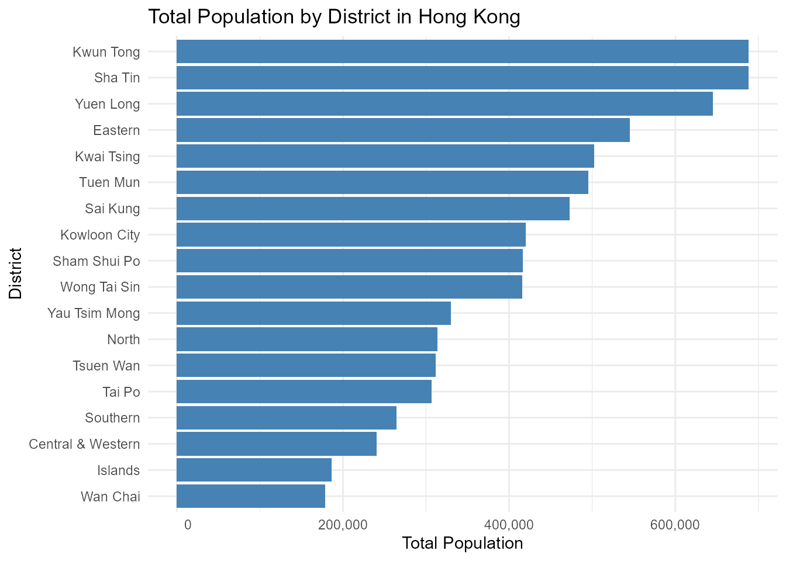

# ChinAPIs: Access Chinese Data via Public APIs and Curated Datasets

``` r

library(ChinAPIs)
library(ggplot2)
library(dplyr)
#> 
#> Attaching package: 'dplyr'
#> The following objects are masked from 'package:stats':
#> 
#>     filter, lag
#> The following objects are masked from 'package:base':
#> 
#>     intersect, setdiff, setequal, union
```

## Introduction

The `ChinAPIs` package provides a unified interface to access open data
from the **World Bank API** and **Nager.Date API**, with a focus on
**China**. It allows users to retrieve up-to-date information on topics
such as economic indicators, population statistics, unemployment rates,
and holidays.

In addition to API-access functions, the package includes one of the
largest curated collections of open datasets related to **China** and
**Hong Kong**. These datasets cover areas such as air quality,
demographic indicators, input-output economic tables, epidemiology,
administrative divisions, name distributions, political structure, and
various social indicators.

`ChinAPIs` is designed to support users working with data related to
**China** by combining international API sources with structured
datasets from public, academic, and governmental sources in a single,
easy-to-use R package.

### Functions for ChinAPIs

The `ChinAPIs` package provides several core functions to access
real-time and structured information about **China** from public APIs
such as the **World Bank API** and **Nager.Date**.

Below is a list of the main functions included in the package:

- [`get_china_gdp()`](https://lightbluetitan.github.io/chinapis/reference/get_china_gdp.md):
  Get China’s Gross Domestic Product (current US\$) from the World Bank

- [`get_china_cpi()`](https://lightbluetitan.github.io/chinapis/reference/get_china_cpi.md):
  Get China’s Consumer Price Index from World Bank

- [`get_china_population()`](https://lightbluetitan.github.io/chinapis/reference/get_china_population.md):
  Get China’s total population from the World Bank

- [`get_china_literacy_rate()`](https://lightbluetitan.github.io/chinapis/reference/get_china_literacy_rate.md):
  Get China’s adult literacy rate (Age 15+) from the World Bank

- [`get_china_life_expectancy()`](https://lightbluetitan.github.io/chinapis/reference/get_china_life_expectancy.md):
  Get life expectancy at birth for China from the World Bank

- [`get_china_unemployment()`](https://lightbluetitan.github.io/chinapis/reference/get_china_unemployment.md):
  Get China’s Unemployment Rate from World Bank

- [`get_china_energy_use()`](https://lightbluetitan.github.io/chinapis/reference/get_china_energy_use.md):
  Get China’s energy use per capita (kg of oil equivalent) from the
  World Bank

- [`get_china_child_mortality()`](https://lightbluetitan.github.io/chinapis/reference/get_china_child_mortality.md):
  Get under-5 mortality rate (per 1,000 live births) in China from the
  World Bank

- [`get_china_hospital_beds()`](https://lightbluetitan.github.io/chinapis/reference/get_china_hospital_beds.md):
  Get hospital beds per 1,000 people in China from the World Bank

- [`get_china_holidays()`](https://lightbluetitan.github.io/chinapis/reference/get_china_holidays.md):
  Get official public holidays in China for a given year,
  e.g. get_china_holidays(2025)

- [`view_datasets_ChinAPIs()`](https://lightbluetitan.github.io/chinapis/reference/view_datasets_ChinAPIs.md):
  Lists all curated datasets included in the ChinAPIs package

These functions allow users to access high-quality and structured
information on **China**, which can be combined with tools like
**dplyr** and **ggplot2** to support a wide range of data analysis,
visualization, and research tasks. In the following sections, you’ll
find examples on how to work with `ChinAPIs` in practical scenarios.

#### China’s GDP (Current US\$) from World Bank 2022 - 2017

``` r


china_gdp <- head(get_china_gdp())

print(china_gdp)
#> # A tibble: 6 × 5
#>   indicator         country  year   value value_label       
#>   <chr>             <chr>   <int>   <dbl> <chr>             
#> 1 GDP (current US$) China    2022 1.83e13 18,316,765,021,690
#> 2 GDP (current US$) China    2021 1.82e13 18,201,698,719,564
#> 3 GDP (current US$) China    2020 1.50e13 14,996,414,166,715
#> 4 GDP (current US$) China    2019 1.46e13 14,560,167,101,283
#> 5 GDP (current US$) China    2018 1.41e13 14,147,765,772,964
#> 6 GDP (current US$) China    2017 1.25e13 12,537,559,062,283
```

#### China’s Life Expectancy at Birth from World Bank 2022 - 2017

``` r


life_expectancy <- head(get_china_life_expectancy())

print(life_expectancy)
#> # A tibble: 6 × 4
#>   indicator                               country  year value
#>   <chr>                                   <chr>   <int> <dbl>
#> 1 Life expectancy at birth, total (years) China    2022  78.2
#> 2 Life expectancy at birth, total (years) China    2021  78.1
#> 3 Life expectancy at birth, total (years) China    2020  78.0
#> 4 Life expectancy at birth, total (years) China    2019  77.9
#> 5 Life expectancy at birth, total (years) China    2018  77.7
#> 6 Life expectancy at birth, total (years) China    2017  77.2
```

#### China’s Total Population from World Bank 2022 - 2017

``` r


china_population <- head(get_china_population())

print(china_population)
#> # A tibble: 6 × 5
#>   indicator         country  year      value value_label  
#>   <chr>             <chr>   <int>      <int> <chr>        
#> 1 Population, total China    2022 1412175000 1,412,175,000
#> 2 Population, total China    2021 1412360000 1,412,360,000
#> 3 Population, total China    2020 1411100000 1,411,100,000
#> 4 Population, total China    2019 1407745000 1,407,745,000
#> 5 Population, total China    2018 1402760000 1,402,760,000
#> 6 Population, total China    2017 1396215000 1,396,215,000
```

### Total Population by District in Hong Kong

``` r


# Plot total population by district with formatted x-axis labels
hk_population_tbl_df %>%
  arrange(desc(TotalPopulation)) %>%
  ggplot(aes(x = reorder(District_EN, TotalPopulation), y = TotalPopulation)) +
  geom_col(fill = "steelblue") +
  coord_flip() +
  scale_y_continuous(labels = function(x) format(x, big.mark = ",", scientific = FALSE)) +
  labs(
    title = "Total Population by District in Hong Kong",
    x = "District",
    y = "Total Population"
  ) +
  theme_minimal()
```



### Dataset Suffixes

Each dataset in `ChinAPIs` is labeled with a *suffix* to indicate its
structure and type:

- `_df`: A standard data frame.

- `_tbl_df`: A tibble data frame object.

- `_list`: A list object.

- `_matrix`: A matrix object.

### Datasets Included in ChinAPIs

In addition to API access functions, `ChinAPIs` provides one of the
largest curated collections of open datasets focused on **China** and
**Hong Kong**. These preloaded datasets cover topics such as air
quality, administrative divisions, input-output tables, names,
demographics, infrastructure, and public health. Below are some featured
examples:

- `hk_population_tbl_df`: Hong Kong Population by District and Age Group

- `chinese_cities_tbl_df`: A tibble that contains information about 367
  prominent cities in China

- `family_name_df`: Chinese Surnames and National Frequency (1930–2008)

### Conclusion

The `ChinAPIs` package offers a comprehensive interface to access
curated datasets and structured data about **China**, encompassing a
wide range of topics relevant to the country’s environment, economy,
demography, and public infrastructure. Unlike other tools focused solely
on API connections, ChinAPIs provides preloaded datasets that include
information on air quality in **Beijing**, corruption perception
indices, inter-industry input-output tables across multiple years,
detailed demographic records, COVID-19 and SARS statistics in Hong Kong,
as well as data on Chinese dams, pandas, administrative divisions, and
given/family names.

These datasets enable users to analyze patterns in urban development,
public health, environmental quality, political structure, and social
trends. The package serves as a valuable resource for researchers,
educators, journalists, and developers interested in **China**’s
contemporary landscape, offering localized, high-resolution data in tidy
formats ready for direct use in R.

Together, `ChinAPIs` helps bridge the gap between complex Chinese open
data sources and accessible, reproducible, and transparent data science
workflows in R.
