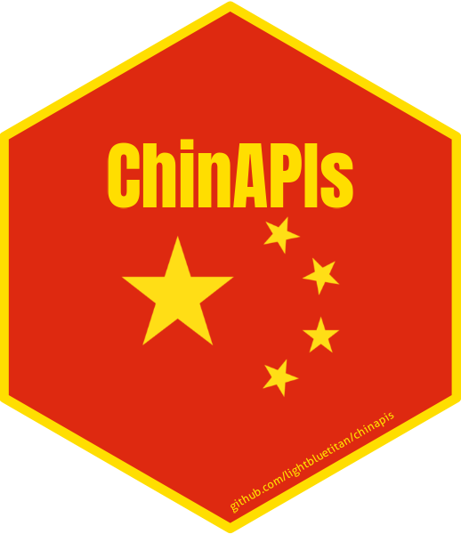

# ChinAPIs: Access Chinese Data via APIs and Curated Datasets

This package provides functions to access data from public RESTful APIs
including 'Nager.Date', 'World Bank API', and 'REST Countries API',
retrieving real-time or historical data related to China, such as
holidays, economic indicators, and international demographic and
geopolitical indicators. Additionally, the package includes one of the
largest curated collections of datasets focused on China and Hong Kong.

## Details

ChinAPIs: Access Chinese Data via APIs and Curated Datasets

Access Chinese Data via APIs and Curated Datasets.

## See also

Useful links:

- <https://github.com/lightbluetitan/chinapis>

## Author

**Maintainer**: Renzo Caceres Rossi <arenzocaceresrossi@gmail.com>
